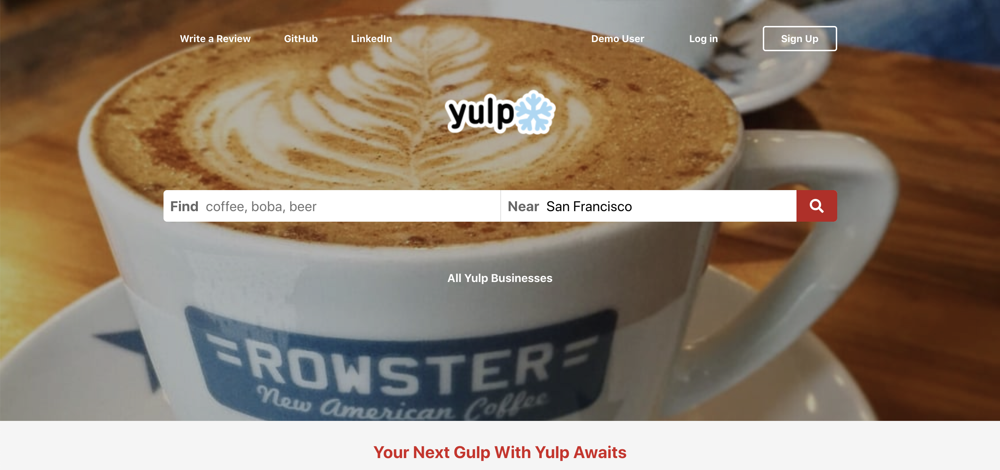
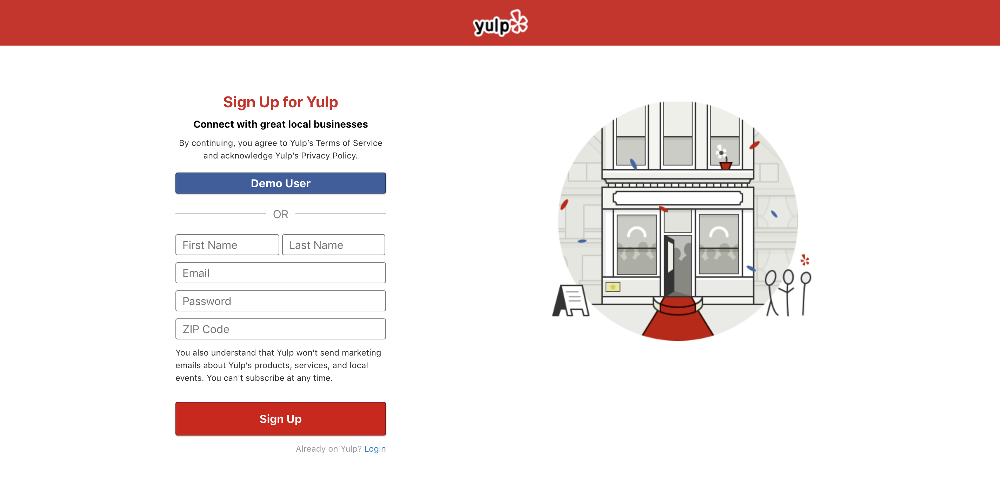
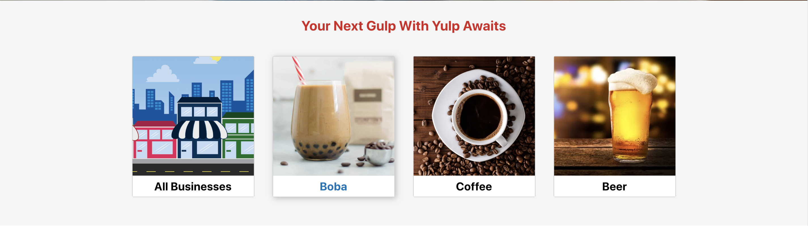
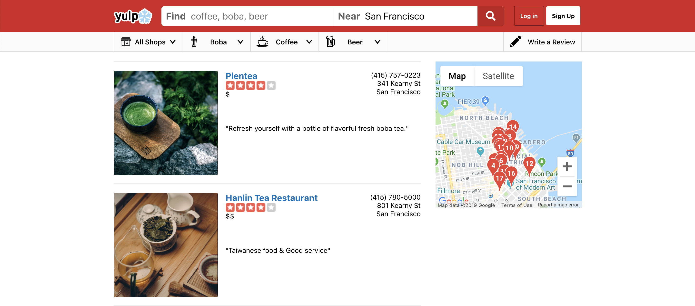
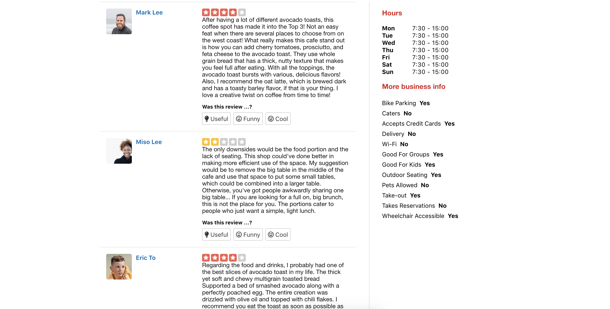
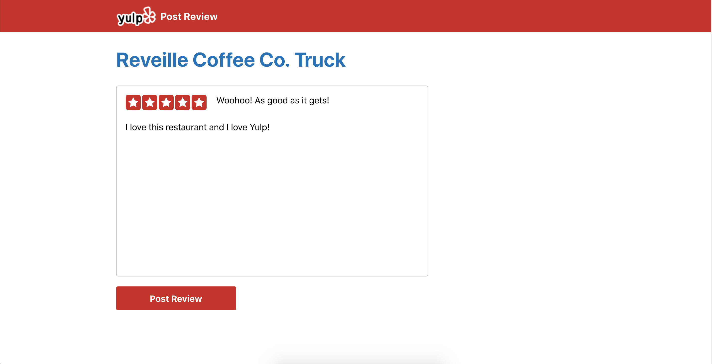

# [Visit Yulp](https://yulp.herokuapp.com/)

Yulp is a pixel-perfect clone of the restaurant review website Yelp. Users are able to check out restaurants and leave their personalized reviews of their experience to share with other users.

## Technologies Used

* Ruby on Rails
* PostgreSQL
* React.js and Redux
* HTML and CSS

## Features

#### **User Security**
Protect user authentication security information from frontend to backend using BCrypt.

#### **Choose Search Categories**
Allow users to view businesses based on all businesses or specific beverage types.

#### **GoogleMap API**
Display business location on a map using the GoogleMap API.

#### **Reviews**
List reviews relative to each business on a business show page.

#### **Responsive Rating**
Permit logged in users to write, edit, and delete reviews for all other users to read.

